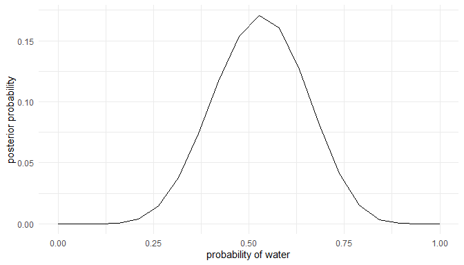
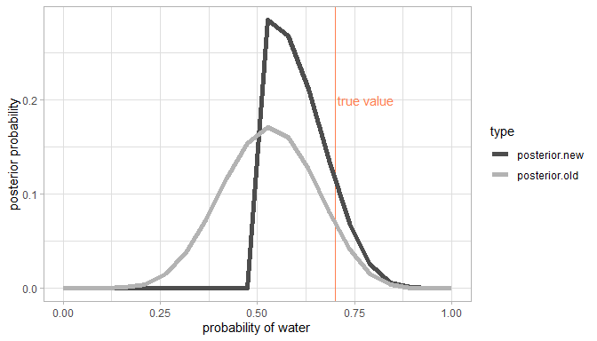
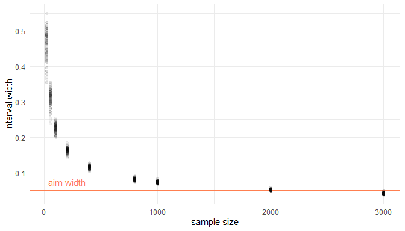
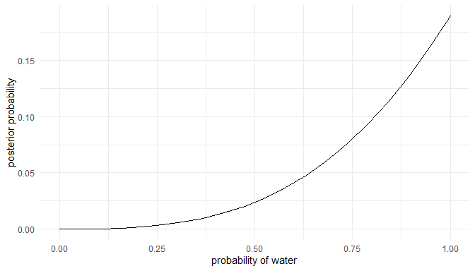
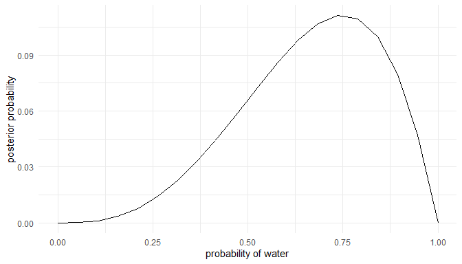
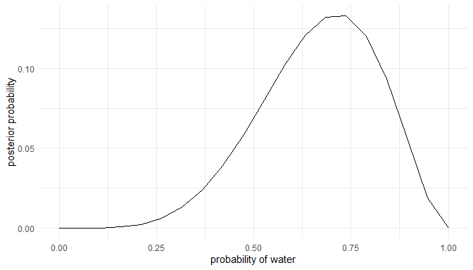
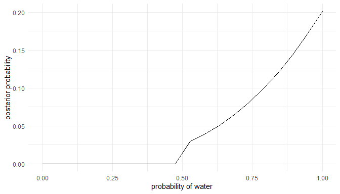
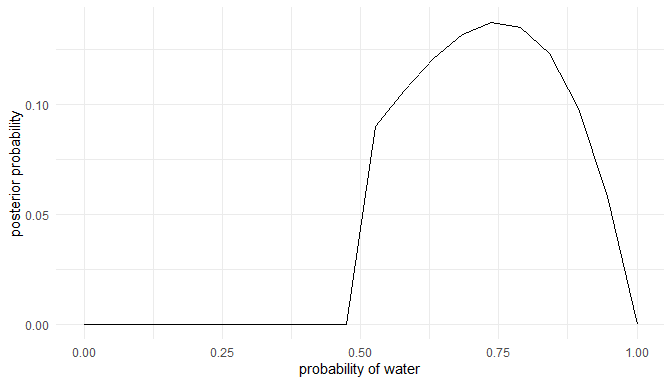
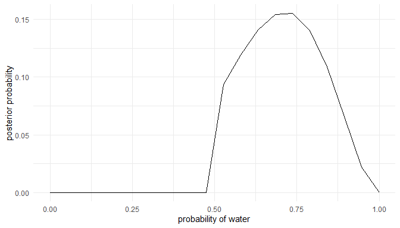

# Introduction 

This is the first part of a series where I work through the practice questions of the second edition of Richard McElreaths [Statistical Rethinking](https://xcelab.net/rm/statistical-rethinking/). Each post covers a new chapter. There are already some awesome sources for this book online like [Jeffrey Girard](https://jmgirard.com/statistical-rethinking-ch2/) working through the exercises of the first edition, or [Solomon Kurz](https://bookdown.org/ajkurz/Statistical_Rethinking_recoded/) leading through each example of the book with the *brms* and the *tidyverse* packages. You can even watch the [lectures of McElreath](https://www.youtube.com/playlist?list=PLDcUM9US4XdNM4Edgs7weiyIguLSToZRI) on Youtube and work through the [homework and solutions](https://github.com/rmcelreath/statrethinking_winter2019/tree/master/homework).
However, so far I couldn't find a source providing solutions for the practice questions of the second edition, or the homework practices, in a tidy(-verse) way. My aim here is therefore to provide solutions for each homework and practice question of the second edition, using the *tidyverse* and the *rethinking* packages. The first part of the series will cover chapter 2, which corresponds to week 1 of the lectures and homework. 

# Homework

## Question 1

**Suppose the globe tossing data had turned out to be 8 water in 15 tosses. Construct the posterior distribution, using grid approximation. Use the same flat prior as before.**

We can do all of this in one pipe:


```r
tibble(
  # define grid
  p.grid = seq(from = 0, to = 1, length.out = 20), 
  # define prior, in this case flat
  prior = rep(1, 20)
  ) %>% 
  # compute likelihood at each value in grid for 8 water in 15 tosses 
  mutate(likelihood = dbinom(8, size = 15, prob = p.grid),
         # compute product of likelihood and prior
         unstd.likelihood = likelihood * prior,
         # standardise the posterior so it sums to 1
         posterior = unstd.likelihood / sum(unstd.likelihood)) %>% 
  # directly pipe that to a ggplot
  ggplot() +
  geom_line(aes(p.grid, posterior)) +
  labs(y = "posterior probability", x = "probability of water") +
  theme_minimal()
```

<!-- -->

## Question 2

**Start over in 1, but now use a prior that is zero below p = 0:5 and a constant above p = 0:5. This corresponds to prior information that a majority of the Earth’s surface is water. What difference does the better prior make? If it helps, compare posterior distributions (using both priors) to the true value p = 0:7.**

Same approach, but with additional colums. First we calculate old and new posteriors and then transform it to longer format for plotting. 


```r
grid_comp <- tibble(
  # define grid
  p.grid = seq(from = 0, to = 1, length.out = 20), 
  # define flat prior used in question 1
  prior.old = rep(1, 20)
) %>% 
  # new prior with majority water
  mutate(prior.new = if_else(p.grid <= 0.5, 0, 1), 
         # compute likelihood at each value in grid for 8 water in 15 tosses 
         likelihood = dbinom(8, size = 15, prob = p.grid), 
         # compute product of likelihood and prior
         unstd.likelihood.old = likelihood * prior.old, 
         unstd.likelihood.new = likelihood * prior.new, 
         # standardise the posterior so it sums to 1
         posterior.old = unstd.likelihood.old / sum(unstd.likelihood.old),
         posterior.new = unstd.likelihood.new / sum(unstd.likelihood.new)) 

# data wrangling for plotting
grid_comp %>% 
  # select colums needed
  select(p.grid, posterior.old, posterior.new) %>% 
  # transform it to longer format
  pivot_longer(cols = c(posterior.old, posterior.new),
               names_to = "type", values_to = "posterior") %>% 
  # pipe it to ggplot
  ggplot(aes(x = p.grid, y = posterior, colour = type)) +
  # add true value
  geom_vline(xintercept = 0.7, colour = "coral") +
  # label line
  annotate("text", x = 0.78, y = 0.2, label = "true value", colour = "coral") +
  geom_line(size = 2) +
  scale_colour_manual(values =c("grey30", "grey70")) +
  labs(y = "posterior probability", x = "probability of water") +
  theme_light()
```

<!-- -->

## Question 3

**This problem is more open-ended than the others. Feel free to collaborate on the solution. Suppose you want to estimate the Earth’s proportion of water very precisely. Specifically, you want the 99% percentile interval of the posterior distribution of p to be only 0.05 wide. This means the distance between the upper and lower bound of the interval should be 0.05. How many times will you have to toss the globe to do this? I won’t require a precise answer. I’m honestly more interested in your approach.**

As mentioned, this is going to be tricky. We need to simulate sample sizes, and then iteratively apply a function that calculates the 99% percentile interval to these sample sizes. Let's define the function: 


```r
int_width <- function(n) {
  # dependant on our sample size n, we draw the summed up number of water from a 
  # binomial distribution
  w <- rbinom(1, size = n, prob = 0.7)
  
  # now we need to apply our standard procedure to get the posterior based on grid
  # approximation
  tibble(
    # define grid
    p.grid = seq(from = 0, to = 1, length.out = 1000
    ),
    # define prior
    prior = rep(1, 1000)) %>%
    # compute likelihood at each value in grid for
    mutate(
      likelihood = dbinom(w, size = n, prob = p.grid),
      # compute product of likelihood and prior
      unstd.likelihood = likelihood * prior,
      # standardise the posterior so it sums to 1
      posterior = unstd.likelihood / sum(unstd.likelihood)
    ) %>%
    select(posterior, p.grid) %>%
    # draw samples
    sample_n(size = 1000, weight = posterior, replace = TRUE) %>%
    # get 99% percentile interval
    summarise(per.int = PI(samples = p.grid, prob = 0.99)) %>%
    # get the total width
    summarise(width = diff(per.int)) %>% 
    pull()
}
```

Now we can apply the function to our sample sizes. I use sample sizes up to 3000, and run 100 simulation at each sample size. 


```r
# define sample sizes
n_list <- c(20, 50, 100, 200, 400, 800, 1000, 2000, 3000) %>%
  # repeat each sample size 100 times
  rep(., each = 100)

# we use map_dfr to apply the int_width function to n_list
sim_width <- map_dfr(n_list, int_width) %>% 
  # some data wrangling for plotting
  add_column(n.list = n_list) %>% 
  rename("width" = "100%") 


# pipe it to ggplot
ggplot(sim_width) +
  # reference line and text
  geom_hline(yintercept = 0.05, color = "coral") +
  annotate("text", x = 200, y = 0.075, label = "aim width", colour = "coral") +
  # simulations
  geom_point(aes(x = n.list, y = width), alpha = 0.05) +
  labs(x = "sample size", y = "interval width") +
  theme_minimal()
```

<!-- -->
  
  
It seems that more than 2000, but less than 3000 globe tosses are sufficient to produce interval that precise. 

# Easy practices

## Question 2E1

**Which of the expressions below correspond to the statement: "the probability of rain on Monday?"**

1. Pr(rain)
2. Pr(rain|Monday)
3. Pr(Monday|rain)
4. Pr(rain,Monday)/Pr(Monday)

Let's rephrase each expression as a statement:
1 is the probability of rain.  
2 is the probability of rain, given that it is Monday.
3 is the probability of it being Monday, given rain.  
4 is the probability of rain and it being Monday, given that it is Monday.  

It is quite obvious that 2 is the correct answer here, but 4 is correct as well. Using the joint probability definition on page 37, we can see that *PR(rain, Mondy)/Pr(Monday) = Pr(rain|Monday)*.

## Question 2E2

**Which of the following statements corresponds to the expression: "Pr(Monday|rain)?"**

1. The probability of rain on Monday.
2. The probability of rain, given that it is Monday.
3. The probability that it is Monday, given that it is raining.
4. The probability that it is Monday and that it is raining.

Now we have to convert each statement to an expression:
1 would be Pr(rain|Monday).  
2 would be Pr(rain|Monday).  
3 would be Pr(Monday|rain).  
4 would be Pr(Monday,rain).  

The correct answer is 3. 

## Question 2E3

**Which of the expressions below correspond to the statement: "the probability that it is Monday, given that it is raining?"**

Pr(Monday|rain)
Pr(rain|Monday)
Pr(rain|Monday)Pr(Monday)
Pr(rain|Monday)Pr(Monday)/Pr(rain)
Pr(Monday|rain)Pr(rain)/Pr(Monday)

Let’s convert each expression into a statement:
1 would be the probability that it is Monday, given that it is raining.
2 would be the probability of rain, given that it is Monday.
3 needs to be converted using the formula on page 37:
*Pr(rain|Monday)Pr(Monday) = Pr(rain,Monday)*  
4 is the same as the previous option but with division added:
*Pr(rain|Monday)Pr(Monday)/Pr(rain) = Pr(rain,Monday)/Pr(rain)*
Simplify this using joint probability:
*Pr(rain,Monday)/Pr(rain) = Pr(Monday|rain)*  
5 is the same as 4 but with the terms exchanged. So it can be interpreted (repeating all the previous work) as the probability of rain, given that it is Monday.

The correct answers are thus 1 and 4.

## Question 2E4

**The Bayesian statistician Bruno de Finetti (1906-1985) began his book on probability theory with the declaration: “PROBABILITY DOES NOT EXIST.” The capitals appeared in the original, so I imagine de Finetti wanted us to shout the statement. What he meant is that probability is a device for describing uncertainty from the perspective of an observer with limited knowledge; it has no objective reality. Discuss the globe tossing example from the chapter, in light of this statement. What does it mean to say “the probability of water is 0.7”?**

Solution copied over from [Jeffrey Girard](https://jmgirard.com/statistical-rethinking-ch2/):  
From the Bayesian perspective, there is one true value of a parameter at any given time and thus there is no uncertainty and no probability in “objective reality.” It is only from the perspective of an observer with limited knowledge of this true value that uncertainty exists and that probability is a useful device. So the statement, “the probability of water is 0.7” means that, given our limited knowledge, our estimate of this parameter’s value is 0.7 (but it has some single true value independent of our uncertainty).  


# Medium practices

## Question 2M1

**Recall the globe tossing model from the chapter. Compute and plot the grid approximate posterior distribution for each of the following sets of observations. In each case, assume a uniform prior for p.**

1. W,W,W
2. W,W,W,L
3. L,W,W,L,W,W,W

The solution for this is given on page 40. Let's transform it to a pipe. As we apply three inputs to it, we can save some time by making a function of w for water and l for land. 


```r
grid_approx <- function(w, l){
tibble(
  # define grid
  p.grid = seq(from = 0, to = 1, length.out = 20), 
  # define prior
  prior = rep(1, 20)
  ) %>% 
  # compute likelihood at each value in grid for 
    mutate(likelihood = dbinom(w, size = w + l, prob = p.grid),
           # compute product of likelihood and prior
           unstd.likelihood = likelihood * prior,
           # standardise the posterior so it sums to 1
           posterior = unstd.likelihood / sum(unstd.likelihood)) %>% 
  # directly pipe that to a ggplot
  ggplot() +
  geom_line(aes(p.grid, posterior)) +
  labs(y = "posterior probability", x = "probability of water") +
  theme_minimal()
}
```

Now we can approximate the posterior for each option.  
Option 1:

```r
grid_approx(w = 3, l = 0) # 3 water, 0 land
```

<!-- -->

Option 2:

```r
grid_approx(w = 3, l = 1) # 3 water, 1 land
```

<!-- -->

Option 3:

```r
grid_approx(w = 5, l = 2) # 5 water, 2 land
```

<!-- -->

## Question 2M2

**Now assume a prior for p that is equal to zero when p<0.5 and is a positive constant when p≥0.5. Again compute and plot the grid approximate posterior distribution for each of the sets of observations in the problem just above.**

All we have to do is to update the prior outside of the tibble in our 'grid_approx()' function:


```r
grid_approx <- function(w, l){
tibble(
  # define grid
  p.grid = seq(from = 0, to = 1, length.out = 20), 
  ) %>% 
  # define prior
    mutate(prior = if_else(p.grid <= 0.5, 0, 1),
           # compute likelihood at each value in grid for
           likelihood = dbinom(w, size = w + l, prob = p.grid),
           # compute product of likelihood and prior
           unstd.likelihood = likelihood * prior,
           # standardise the posterior so it sums to 1
           posterior = unstd.likelihood / sum(unstd.likelihood)) %>% 
  # directly pipe that to a ggplot
  ggplot() +
  geom_line(aes(p.grid, posterior)) +
  labs(y = "posterior probability", x = "probability of water") +
  theme_minimal()
}
```

Now we can apply the function to our three options again. 
Option 1:

```r
grid_approx(w = 3, l = 0) # 3 water, 0 land
```

<!-- -->

Option 2:

```r
grid_approx(w = 3, l = 1) # 3 water, 1 land
```

<!-- -->

Option 3:

```r
grid_approx(w = 5, l = 2) # 5 water, 2 land
```

<!-- -->

## Question 2M3 to 2H4 

Questions 2M3 to 2H4 are rather phylosophical and can be solved by applying the equations given in the chapter. No code is needed to solve the questions and each question is the same as in the first edition, why I refer to the [solutions from Jeffrey Girard](https://jmgirard.com/statistical-rethinking-ch2/) here. 
  
   
   
   
--------------------------------------------------------------------------------
  
  

```r
sessionInfo()
```

```
## R version 4.0.0 (2020-04-24)
## Platform: x86_64-w64-mingw32/x64 (64-bit)
## Running under: Windows 10 x64 (build 18363)
## 
## Matrix products: default
## 
## locale:
## [1] LC_COLLATE=German_Germany.1252  LC_CTYPE=German_Germany.1252   
## [3] LC_MONETARY=German_Germany.1252 LC_NUMERIC=C                   
## [5] LC_TIME=German_Germany.1252    
## 
## attached base packages:
## [1] parallel  stats     graphics  grDevices utils     datasets  methods  
## [8] base     
## 
## other attached packages:
##  [1] rethinking_2.01      dagitty_0.2-2        rstan_2.19.3        
##  [4] StanHeaders_2.21.0-5 forcats_0.5.0        stringr_1.4.0       
##  [7] dplyr_1.0.0          purrr_0.3.4          readr_1.3.1         
## [10] tidyr_1.1.0          tibble_3.0.1         ggplot2_3.3.2       
## [13] tidyverse_1.3.0     
## 
## loaded via a namespace (and not attached):
##  [1] httr_1.4.1         jsonlite_1.7.0     modelr_0.1.8       RcppParallel_5.0.2
##  [5] assertthat_0.2.1   stats4_4.0.0       blob_1.2.1         cellranger_1.1.0  
##  [9] yaml_2.2.1         pillar_1.4.4       backports_1.1.8    lattice_0.20-41   
## [13] glue_1.4.1         digest_0.6.25      rvest_0.3.5        colorspace_1.4-1  
## [17] htmltools_0.5.0    pkgconfig_2.0.3    broom_0.5.6        haven_2.3.1       
## [21] mvtnorm_1.1-1      scales_1.1.1       processx_3.4.2     farver_2.0.3      
## [25] generics_0.0.2     ellipsis_0.3.1     withr_2.2.0        cli_2.0.2         
## [29] magrittr_1.5       crayon_1.3.4       readxl_1.3.1       evaluate_0.14     
## [33] ps_1.3.3           fs_1.4.2           fansi_0.4.1        nlme_3.1-147      
## [37] MASS_7.3-51.5      xml2_1.3.2         pkgbuild_1.0.8     tools_4.0.0       
## [41] loo_2.2.0          prettyunits_1.1.1  hms_0.5.3          lifecycle_0.2.0   
## [45] matrixStats_0.56.0 V8_3.2.0           munsell_0.5.0      reprex_0.3.0      
## [49] callr_3.4.3        compiler_4.0.0     rlang_0.4.6        grid_4.0.0        
## [53] rstudioapi_0.11    labeling_0.3       rmarkdown_2.3      boot_1.3-24       
## [57] gtable_0.3.0       inline_0.3.15      DBI_1.1.0          curl_4.3          
## [61] R6_2.4.1           gridExtra_2.3      lubridate_1.7.9    knitr_1.29        
## [65] shape_1.4.4        stringi_1.4.6      Rcpp_1.0.4.6       vctrs_0.3.1       
## [69] dbplyr_1.4.4       tidyselect_1.1.0   xfun_0.15          coda_0.19-3
```

