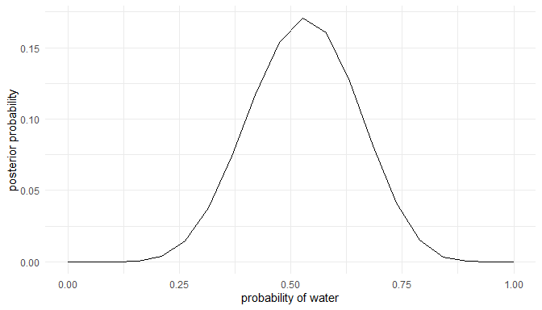
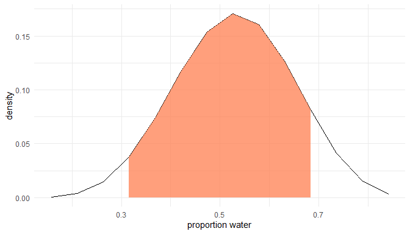
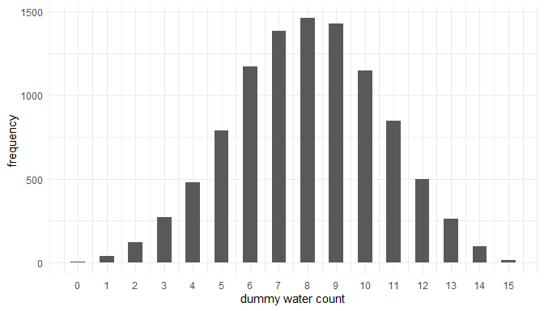
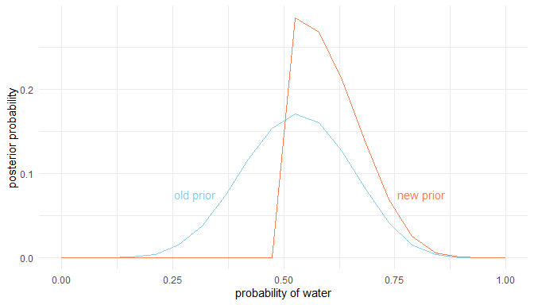
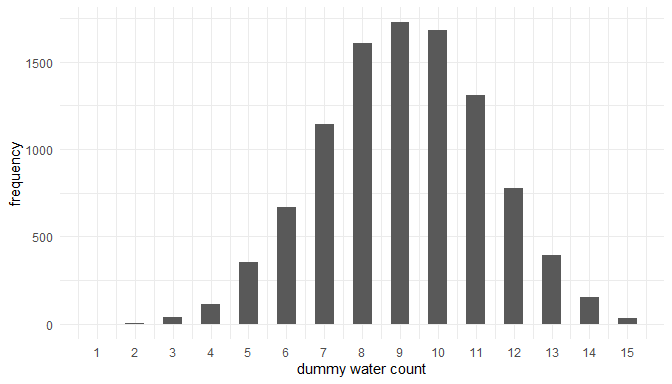
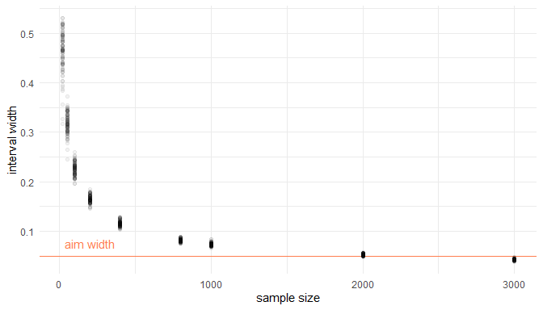
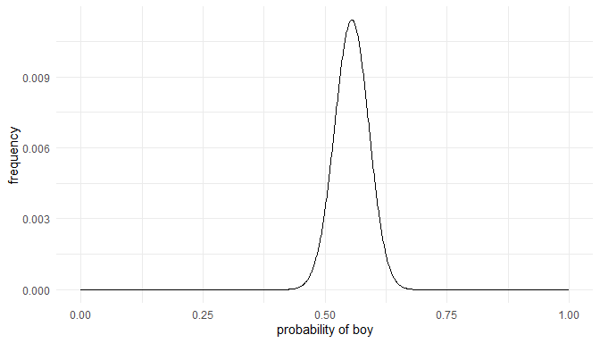
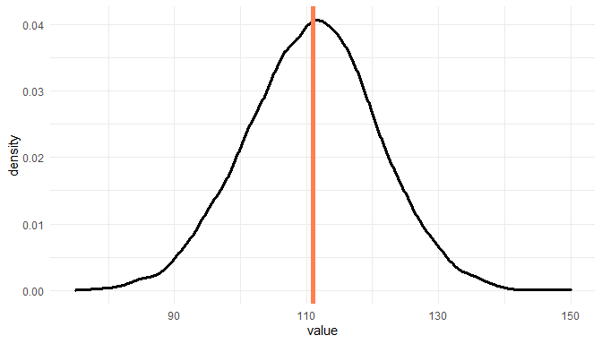
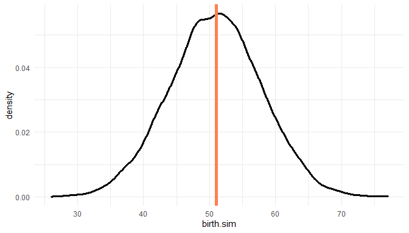
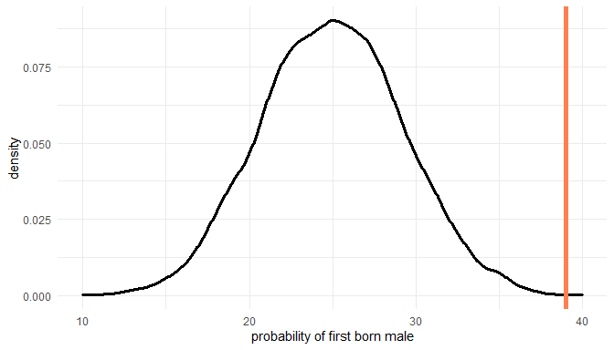

# Introduction 

This is the second part of a series where I work through the practice questions of the second edition of Richard McElreaths [Statistical Rethinking](https://xcelab.net/rm/statistical-rethinking/). Each post covers a new chapter. There are already some awesome sources for this book online like [Jeffrey Girard](https://jmgirard.com/statistical-rethinking-ch2/) working through the exercises of the first edition, or [Solomon Kurz](https://bookdown.org/ajkurz/Statistical_Rethinking_recoded/) leading through each example of the book with the *brms* and the *tidyverse* packages. You can even watch the [lectures of McElreath](https://www.youtube.com/playlist?list=PLDcUM9US4XdNM4Edgs7weiyIguLSToZRI) on Youtube and work through the [homework and solutions](https://github.com/rmcelreath/statrethinking_winter2019/tree/master/homework).
However, so far I couldn't find a source providing solutions for the practice questions of the second edition, or the homework practices, in a tidy(-verse) way. My aim here is therefore to provide solutions for each homework and practice question of the second edition, using the *tidyverse* and the *rethinking* packages. The second part of the series will cover chapter 3, which corresponds to week 1 of the lectures and homework. 

# Homework

All homework questions for week 1 are already solved in my previous post *Rethinking Chapter 2*.

# Easy practices

The easy problems use the samples from the posterior distribution for the globe tossing example. This code will give you a specific set of samples, so that you can check your answers exactly: 


```r
# set the seed for reproducibility
set.seed(100)
samples <- tibble(# define grid
  p.grid = seq(from = 0, to = 1, length.out = 1000
  ),
  # define prior
  prior = rep(1, 1000)) %>%
  # compute likelihood at each value in grid for
  mutate(
    likelihood = dbinom(6, size = 9, prob = p.grid),
    # compute product of likelihood and prior
    unstd.likelihood = likelihood * prior,
    # standardise the posterior so it sums to 1
    posterior = unstd.likelihood / sum(unstd.likelihood)
  ) %>%
  select(posterior, p.grid) %>%
  # draw samples
  sample_n(size = 1000, weight = posterior, replace = TRUE) %>% 
  select(values = p.grid)
```

## Question 3E1

**How much posterior probability lies below p = 0.2?**

First we need to select all samples below p = 0.2, and then sum these up and finally divide by the total number of values. 


```r
samples %>% 
  filter(values < 0.2) %>%
  summarise(p = n()/1000) %>% 
  mutate(p_perc = p * 100)
```

```
## # A tibble: 1 x 2
##       p p_perc
##   <dbl>  <dbl>
## 1 0.001    0.1
```

So obviously not much. To be precise, 0.1% of the posterior probability lies below p = 0.2, using our seed.

## Question 3E2

**How much posterior probability lies above p = 0.8?**

Same procedure:


```r
samples %>% 
  filter(values > 0.8) %>%
  summarise(p = n()/1000) %>% 
  mutate(p_perc = p * 100)
```

```
## # A tibble: 1 x 2
##       p p_perc
##   <dbl>  <dbl>
## 1 0.091    9.1
```

A bit more, 9.1 %

## Question 3E3

**How much posterior probability lies between p = 0.2 and p = 0.8?**

Modify the `select()` function. 


```r
samples %>% 
  filter(values > 0.2 & values < 0.8) %>%
  summarise(p = n()/1000) %>% 
  mutate(p_perc = p * 100)
```

```
## # A tibble: 1 x 2
##       p p_perc
##   <dbl>  <dbl>
## 1 0.908   90.8
```

Well, the rest (90.8%) lies between. 

## Question 3E4

**20% of the posterior probability lies below which value of p?**

We can use the `quantile()` function within `summarise()` to get the answer (see page 54):


```r
samples %>% 
  summarise(quants = quantile(values, probs = 0.2))
```

```
## # A tibble: 1 x 1
##   quants
##    <dbl>
## 1  0.516
```

20% of the posterior probability lies below p = 0.52.


## Question 3E5
**20% of the posterior probability lies above which value of p?**

Same procedure, just subtract the probability from 1:


```r
samples %>% 
  summarise(quants = quantile(values, probs = 1 - 0.2))
```

```
## # A tibble: 1 x 1
##   quants
##    <dbl>
## 1  0.743
```

20% of the posterior probability lies above p = 0.74.

## Question 3E6

**Which values of p contain the narrowest interval equal to 66% of the posterior probability?**

To get the narrowest interval, we need to find the highest posterior density interval with the `HPDI()` function (see page 57):


```r
samples %>% 
  HPDI(prob = 0.66)
```

```
##     |0.66     0.66| 
## 0.5135135 0.7697698
```

The narrowest interval equal to 66% of the posterior probability lies between p = 0.51 and p = 0.77.

## Question 3E7
**Which values of p contain 66% of the posterior probability, assuming equal posterior probability both below and above the interval?**

To get the interval that has equal probability mass in each tail, we need to find the percentile interval using the `PI()` function (see page 56). Unfortunately, we need to use curly brackets to tell the function which values to use in a pipe:


```r
samples %>% 
  {PI(.$values, prob = 0.66)}
```

```
##       17%       83% 
## 0.4961562 0.7569269
```

The answer is p = 0.5 and p = 0.76.

# Medium practices

## Question 3M1

**Suppose the globe tossing data had turned out to be 8 water in 15 tosses. Construct the posterior distribution, using grid approximation. Use the same flat prior as before.**

We can do all of this in one pipe:


```r
post_dist <- tibble(
  # define grid
  p.grid = seq(from = 0, to = 1, length.out = 20), 
  # define prior, in this case flat
  prior = rep(1, 20)
  ) %>% 
  # compute likelihood at each value in grid for 8 water in 15 tosses 
  mutate(likelihood = dbinom(8, size = 15, prob = p.grid),
         # compute product of likelihood and prior
         unstd.likelihood = likelihood * prior,
         # standardise the posterior so it sums to 1
         posterior = unstd.likelihood / sum(unstd.likelihood)) 

# make a ggplot
ggplot(post_dist) +
  geom_line(aes(p.grid, posterior)) +
  labs(y = "posterior probability", x = "probability of water") +
  theme_minimal()
```

<!-- -->

## Question 3M2
**Draw 10,000 samples from the grid approximation from above. Then use the samples to calculate the 90% HPDI for p.**


```r
samples <- post_dist %>% 
  sample_n(size = 1e4, weight = posterior, replace = TRUE) 
  
HPDI(samples$p.grid, prob = 0.9)
```

```
##      |0.9      0.9| 
## 0.3157895 0.6842105
```

The 90% HPDI is within [0.32, 0.68].  
We can plot this and shade the highest posterior density interval:


```r
samples %>%
  mutate(hpdi.int = ifelse(
    p.grid < HPDI(p.grid, prob = 0.9)[1] |
      p.grid > HPDI(p.grid, prob = 0.9)[2],
    NA,
    p.grid
  )) %>% 
  ggplot() +
  geom_line(aes(x = p.grid, y = posterior)) +
  geom_ribbon(aes(x = hpdi.int, ymin = 0, ymax = posterior), 
              alpha = 0.75, fill = "coral") +
  labs(x = "proportion water", y = "density") +
  theme_minimal()
```

<!-- -->

## Question 3M3

**Construct a posterior predictive check for this model and data. This means simulate the distribution of samples, averaging over the posterior uncertainty in p. What is the probability of observing 8 water in 15 tosses?**

To simulate the distribution of samples, we need to use the `rbinom()` function and provide the appropriate probability distribution (see page 65).


```r
w_eight <- rbinom(1e4, size = 15, prob = samples$p.grid) %>%
  enframe(name = "n_row", value = "trials")
```

We can plot the distribution of simulated sample observations from 15 tosses of the globe. 


```r
ggplot(w_eight) +
  geom_histogram(aes(x = trials), binwidth = .5) +
  scale_x_continuous(breaks = seq(0,15,1)) +
  labs(x = "dummy water count", y = "frequency") +
  theme_minimal()
```

<!-- -->

The we can calcultate the probability of observing 8 water in 15 tosses.


```r
w_eight %>% 
  filter(trials == 8) %>% 
  summarise(p_eight = n()/1e4)
```

```
## # A tibble: 1 x 1
##   p_eight
##     <dbl>
## 1   0.146
```

The probability is around 15%. From the histogram, we can see that this is the most likely outcome.

## Question 3M4

**Using the posterior distribution constructed from the new (8/15) data, now calculate the probability of observing 6 water in 9 tosses.**

We can apply the same procedure as in 3M3, simply updating the number of tosses and observed waters.


```r
rbinom(1e4, size = 9, prob = samples$p.grid) %>%
  enframe(name = "n_row", value = "trials") %>%
  filter(trials == 6) %>%
  summarise(p_six = n() / 1e4)
```

```
## # A tibble: 1 x 1
##   p_six
##   <dbl>
## 1 0.176
```

The probability of observing 6 water in 9 tosses is around 18%


## Question 3M5

**Start over at 3M1, but now use a prior that is zero below p=0.5 and a constant above p=0.5. This corresponds to prior information that a majority of the Earth’s surface is water. Repeat each problem above and compare the inferences. What difference does the better prior make? If it helps, compare inferences (using both priors) to the true value p = 0.7.**

Let's first make a `tibble()` with both the old and the new prior: 


```r
comparison <- tibble(
  # define grid
  p.grid = seq(from = 0, to = 1, length.out = 20), 
  # define flat prior used in question 1
  prior.old = rep(1, 20)
) %>% 
  # new prior with majority water
  mutate(prior.new = if_else(p.grid <= 0.5, 0, 1), 
         # compute likelihood at each value in grid for 8 water in 15 tosses 
         likelihood = dbinom(8, size = 15, prob = p.grid), 
         # compute product of likelihood and prior
         unstd.likelihood.old = likelihood * prior.old, 
         unstd.likelihood.new = likelihood * prior.new, 
         # standardise the posterior so it sums to 1
         posterior.old = unstd.likelihood.old / sum(unstd.likelihood.old),
         posterior.new = unstd.likelihood.new / sum(unstd.likelihood.new)) 
```

So now let's compare posterior distributions as in 3M1:


```r
ggplot(comparison) +
  geom_line(aes(p.grid, posterior.old), colour = "skyblue") +
  annotate("text", x = 0.3, y = 0.075, label = "old prior", colour = "skyblue") +
  annotate("text", x = 0.81, y = 0.075, label = "new prior", colour = "coral") +
  geom_line(aes(p.grid, posterior.new), colour = "coral") +
  labs(y = "posterior probability", x = "probability of water") +
  theme_minimal()
```

<!-- -->

We can already see that the new prior better captures the true water proportion of 0.7 way better than the old flat prior. But let us provide some number for this comparison. First, we need to draw samples again and then we can compare intervals as in 3M2:


```r
samples <- comparison %>% 
  sample_n(size = 1e4, weight = posterior.new, replace = TRUE) 
  
HPDI(samples$p.grid, prob = 0.9)
```

```
##      |0.9      0.9| 
## 0.5263158 0.6842105
```

Our highest posterior density interval using the new prior is within [0.53, 0.74] and hence way narrower than our previous one using the old prior [0.32 0.68]. Now we can simulate the distribution of samples as in 3M3 and plot it:


```r
w_eight <- rbinom(1e4, size = 15, prob = samples$p.grid) %>%
  enframe(name = "n_row", value = "trials")

ggplot(w_eight) +
  geom_histogram(aes(x = trials), binwidth = .5) +
  scale_x_continuous(breaks = seq(0,15,1)) +
  labs(x = "dummy water count", y = "frequency") +
  theme_minimal()
```

<!-- -->

And calculate the probability of observing 8 water in 15 tosses.


```r
w_eight %>% 
  filter(trials == 8) %>% 
  summarise(p_eight = n()/1e4)
```

```
## # A tibble: 1 x 1
##   p_eight
##     <dbl>
## 1   0.160
```

The probability of observing 8 water in 15 tosses has increased slightly compared to the old prior. 
Is it the same for 6 out of 9 as in 3M4?


```r
rbinom(1e4, size = 9, prob = samples$p.grid) %>%
  enframe(name = "n_row", value = "trials") %>%
  filter(trials == 6) %>%
  summarise(p_six = n() / 1e4)
```

```
## # A tibble: 1 x 1
##   p_six
##   <dbl>
## 1 0.230
```

Here we see quite a strong increase. 

## Question 3M6

**Suppose you want to estimate the Earth's proportion of water very precisely. Specifically, you want the 99% percentile interval of the posterior distribution of p to be only 0.05 wide. This means the distance between the upper and lower bound of the interval should be 0.05. How many times will you have to toss the globe to do this?**

This is going to be tricky. We need to simulate sample sizes, and then iteratively apply a function that calculates the 99% percentile interval to these sample sizes. Let's define the function: 


```r
int_width <- function(n) {
  # dependant on our sample size n, we draw the summed up number of water from a 
  # binomial distribution
  w <- rbinom(1, size = n, prob = 0.7)
  
  # now we need to apply our standard procedure to get the posterior based on grid
  # approximation
  tibble(
    # define grid
    p.grid = seq(from = 0, to = 1, length.out = 1000
    ),
    # define prior
    prior = rep(1, 1000)) %>%
    # compute likelihood at each value in grid for
    mutate(
      likelihood = dbinom(w, size = n, prob = p.grid),
      # compute product of likelihood and prior
      unstd.likelihood = likelihood * prior,
      # standardise the posterior so it sums to 1
      posterior = unstd.likelihood / sum(unstd.likelihood)
    ) %>%
    select(posterior, p.grid) %>%
    # draw samples
    sample_n(size = 1000, weight = posterior, replace = TRUE) %>%
    # get 99% percentile interval
    summarise(per.int = PI(samples = p.grid, prob = 0.99)) %>%
    # get the total width
    summarise(width = diff(per.int)) %>% 
    pull()
}
```

Now we can apply the function to our sample sizes. I use sample sizes up to 3000, and run 100 simulation at each sample size. 


```r
# define sample sizes
n_list <- c(20, 50, 100, 200, 400, 800, 1000, 2000, 3000) %>%
  # repeat each sample size 100 times
  rep(., each = 100)

# we use map_dfr to apply the int_width function to n_list
map_dfr(n_list, int_width) %>% 
  # some data wrangling for plotting
  add_column(n.list = n_list) %>% 
  rename("width" = "100%") %>% 
  # pipe it to ggplot
  ggplot() +
  # reference line and text
  geom_hline(yintercept = 0.05, color = "coral") +
  annotate("text", x = 200, y = 0.075, label = "aim width", colour = "coral") +
  # simulations
  geom_point(aes(x = n.list, y = width), alpha = 0.05) +
  labs(x = "sample size", y = "interval width") +
  theme_minimal()
```

<!-- -->

It seems that more than 2000, but less than 3000 globe tosses are sufficient to produce an interval that precise. 

# Hard practices

The Hard problems here all use the data below. These data indicate the gender (male = 1, female = 0) of officially reported first and second born children in 100 two-child families. 


```r
data(homeworkch3)
birth1
```

```
##   [1] 1 0 0 0 1 1 0 1 0 1 0 0 1 1 0 1 1 0 0 0 1 0 0 0 1 0 0 0 0 1 1 1 0 1 0 1 1
##  [38] 1 0 1 0 1 1 0 1 0 0 1 1 0 1 0 0 0 0 0 0 0 1 1 0 1 0 0 1 0 0 0 1 0 0 1 1 1
##  [75] 1 0 1 0 1 1 1 1 1 0 0 1 0 1 1 0 1 0 1 1 1 0 1 1 1 1
```

```r
birth2
```

```
##   [1] 0 1 0 1 0 1 1 1 0 0 1 1 1 1 1 0 0 1 1 1 0 0 1 1 1 0 1 1 1 0 1 1 1 0 1 0 0
##  [38] 1 1 1 1 0 0 1 0 1 1 1 1 1 1 1 1 1 1 1 1 1 1 1 1 0 1 1 0 1 1 0 1 1 1 0 0 0
##  [75] 0 0 0 1 0 0 0 1 1 0 0 1 0 0 1 1 0 0 0 1 1 1 0 0 0 0
```

```r
# combine birth data
allbirth <- c(birth1, birth2)
```

## Question 3H1

**Using grid approximation, compute the posterior distribution for the probability of a birth being a boy. Assume a uniform prior probability. Which parameter value maximizes the posterior probability?**

We can use the grid approximation approach given on page 56:


```r
post_dist <- tibble(
  # define grid
  p.grid = seq(from = 0, to = 1, length.out = 1000),
  # define uniform prior
  prior = rep(1, 1000)) %>%
  # compute likelihood at each value in grid for
  mutate(
    likelihood = dbinom(sum(allbirth), size = length(allbirth), prob = p.grid),
    # compute product of likelihood and prior
    unstd.likelihood = likelihood * prior,
    # standardise the posterior so it sums to 1
    posterior = unstd.likelihood / sum(unstd.likelihood)) 

ggplot(post_dist) +
  geom_line(aes(p.grid, posterior)) +
  labs(x = "probability of boy", y = "frequency") +
  theme_minimal()
```

<!-- -->

Instead of the `which.max()` function, we can use `filter()` within a pipe.


```r
post_dist %>% 
  filter(posterior == max(posterior))
```

```
## # A tibble: 1 x 5
##   p.grid prior likelihood unstd.likelihood posterior
##    <dbl> <dbl>      <dbl>            <dbl>     <dbl>
## 1  0.555     1     0.0567           0.0567    0.0114
```

The parameter value that maximizes the posterior probability is p = 0.555.

## Question 3H2

**Using the `sample()` function, draw 10000 random parameter values from the posterior distribution you calculated above. Use these samples to estimate the 50%, 89% and 97% highest posterior density intervals.**

We can use the `sample_n()` function from the *dplyr* package for sampling from the posterior distribution. Then we can use `summarise()` to calculate multiple highest posterior density intervals. 


```r
samples <- post_dist %>% 
    select(posterior, p.grid) %>%
    # draw samples
    sample_n(size = 10000, weight = posterior, replace = TRUE)

samples %>% 
    # get 99% percentile interval
    summarise(HPDI.50 = HPDI(samples = p.grid, prob = 0.5), 
              HPDI.89 = HPDI(samples = p.grid, prob = 0.89), 
              HPDI.97 = HPDI(samples = p.grid, prob = 0.97)) %>% 
  add_column(interval = c("lower", "upper"))
```

```
## # A tibble: 2 x 4
##   HPDI.50 HPDI.89 HPDI.97 interval
##     <dbl>   <dbl>   <dbl> <chr>   
## 1   0.526   0.501   0.475 lower   
## 2   0.573   0.613   0.627 upper
```

## Question 3H3

**Use rbinom() to simulate 10.000 replicates of 200 births. You should end up with 10000 numbers, each one a count of boys out of 200 births. Compare the distribution of predicted numbers of boys to the actual count in the data (111 boys out of 200 births). There are many good ways to visualize the simulations, but the dens() command (part of the rethinking package) is probably the easiest way in this case. Does it look like the model fits the data well? That is, does the distribution of predictions include the actual observation as a central, likely outcome?**

We can use the approach detailed on page 66 to conduct this simulation. Instead of `dens()`, we can use the `geom_density` within *ggplot* and add the actual result to the posterior predictive distribution using `geom_vline()`.


```r
birth_sim <- rbinom(1e4, 200, prob = samples$p.grid) %>% enframe()

ggplot(birth_sim) +
  geom_density(aes(x = value), size = 1.3) +
  geom_vline(xintercept = sum(allbirth), colour = "coral", size = 2) +
  theme_minimal()
```

<!-- -->

Indeed, it does look like the model fits the data well. The actual result plots quite central in the predictions. 

## Question 3H4

**Now compare 10.000 counts of boys from 100 simulated first borns only to the number of boys in the first births, birth1. How does the model look in this light?**

For this, we need to update our posterior distribution to birth1:


```r
post_dist <- tibble(
  # define grid
  p.grid = seq(from = 0, to = 1, length.out = 1000),
  # define uniform prior
  prior = rep(1, 1000)) %>%
  # compute likelihood at each value in grid for
  mutate(
    likelihood = dbinom(sum(birth1), size = length(birth1), prob = p.grid),
    # compute product of likelihood and prior
    unstd.likelihood = likelihood * prior,
    # standardise the posterior so it sums to 1
    posterior = unstd.likelihood / sum(unstd.likelihood))
```

We can visualize the results and compare the predictions to the actual value the same way as before:


```r
# calculate samples
samples <- post_dist %>%
  select(posterior, p.grid) %>%
  # draw samples
  sample_n(size = 1e4, weight = posterior, replace = TRUE) %>%
  # simulate 100 birth
  mutate(birth.sim = rbinom(1e4, 100, prob = p.grid))
  
# plot it
ggplot(samples) +
  geom_density(aes(x = birth.sim), size = 1.3) +
  geom_vline(xintercept = sum(birth1), colour = "coral", size = 2) +
  theme_minimal()
```

<!-- -->
Again, the actual result (51 births) plots quite central in the predictions, indicating a good model fit. 

## Question 3H5

**The model assumes that sex of first and second births are independent. To check this assumption, focus now on second births that followed female first borns. Compare 10.000 simulated counts of boys to only those second births that followed girls. To do this correctly, you need to count the number of first borns who were girls and simulate that many births, 10-000 times. Compare the counts of boys in your simulations to the actual observed count of boys following girls. How does the model look in this light? Any guesses what is going on in these data?**

We first need to count the number of female first borns and simulate that many births, 10000 times:


```r
# female first borns
first_female <- 100 - sum(birth1)

# same approach as in 3H3, samples is still fitted with 100 first borns
birth_sim <- rbinom(1e4, first_female, prob = samples$p.grid) %>% enframe()
```

Then we need the actual observed count of boys following girls:

```r
female_then_male <- 
  # make tibble
  tibble(firstborn = birth1, secondborn = birth2) %>% 
  # select firstborn females
  filter(firstborn == 0) %>% 
  # calculate count of boys following girls
  summarise(female.then.male = sum(secondborn)) %>% 
  pull()
```

Now we can plot the probability distribution of simulated counts of first born boys and compare it to the actual observed count of boys following girls. 


```r
# plot it
ggplot(birth_sim) +
  geom_density(aes(x = value), size = 1.3) +
  geom_vline(xintercept = female_then_male, colour = "coral", size = 2) +
  labs(x = "probability of first born male") +
  theme_minimal()
```

<!-- -->

We can clearly see that the actual value falls outside of our predictions. The assumption for our model that first and second births are independent leads to a poor fit. It seems like there is dependancy between first and second births. 

--------------------------------------------------------------------------------
  
  

```r
sessionInfo()
```

```
## R version 4.0.0 (2020-04-24)
## Platform: x86_64-w64-mingw32/x64 (64-bit)
## Running under: Windows 10 x64 (build 18363)
## 
## Matrix products: default
## 
## locale:
## [1] LC_COLLATE=German_Germany.1252  LC_CTYPE=German_Germany.1252   
## [3] LC_MONETARY=German_Germany.1252 LC_NUMERIC=C                   
## [5] LC_TIME=German_Germany.1252    
## 
## attached base packages:
## [1] parallel  stats     graphics  grDevices utils     datasets  methods  
## [8] base     
## 
## other attached packages:
##  [1] rethinking_2.01      dagitty_0.2-2        rstan_2.19.3        
##  [4] StanHeaders_2.21.0-5 forcats_0.5.0        stringr_1.4.0       
##  [7] dplyr_1.0.0          purrr_0.3.4          readr_1.3.1         
## [10] tidyr_1.1.0          tibble_3.0.1         ggplot2_3.3.2       
## [13] tidyverse_1.3.0     
## 
## loaded via a namespace (and not attached):
##  [1] httr_1.4.1         jsonlite_1.7.0     modelr_0.1.8       RcppParallel_5.0.2
##  [5] assertthat_0.2.1   stats4_4.0.0       blob_1.2.1         cellranger_1.1.0  
##  [9] yaml_2.2.1         pillar_1.4.4       backports_1.1.8    lattice_0.20-41   
## [13] glue_1.4.1         digest_0.6.25      rvest_0.3.5        colorspace_1.4-1  
## [17] htmltools_0.5.0    pkgconfig_2.0.3    broom_0.5.6        haven_2.3.1       
## [21] mvtnorm_1.1-1      scales_1.1.1       processx_3.4.2     farver_2.0.3      
## [25] generics_0.0.2     ellipsis_0.3.1     withr_2.2.0        cli_2.0.2         
## [29] magrittr_1.5       crayon_1.3.4       readxl_1.3.1       evaluate_0.14     
## [33] ps_1.3.3           fs_1.4.2           fansi_0.4.1        nlme_3.1-147      
## [37] MASS_7.3-51.5      xml2_1.3.2         pkgbuild_1.0.8     tools_4.0.0       
## [41] loo_2.2.0          prettyunits_1.1.1  hms_0.5.3          lifecycle_0.2.0   
## [45] matrixStats_0.56.0 V8_3.2.0           munsell_0.5.0      reprex_0.3.0      
## [49] callr_3.4.3        compiler_4.0.0     rlang_0.4.6        grid_4.0.0        
## [53] rstudioapi_0.11    labeling_0.3       rmarkdown_2.3      boot_1.3-24       
## [57] gtable_0.3.0       inline_0.3.15      DBI_1.1.0          curl_4.3          
## [61] R6_2.4.1           gridExtra_2.3      lubridate_1.7.9    knitr_1.29        
## [65] utf8_1.1.4         shape_1.4.4        stringi_1.4.6      Rcpp_1.0.4.6      
## [69] vctrs_0.3.1        dbplyr_1.4.4       tidyselect_1.1.0   xfun_0.15         
## [73] coda_0.19-3
```
