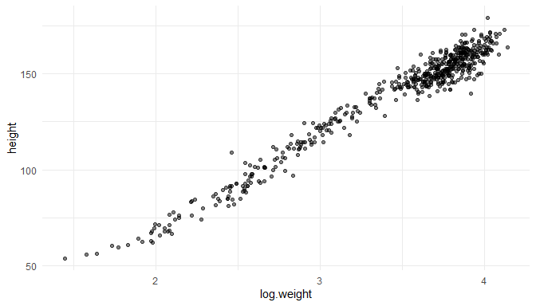
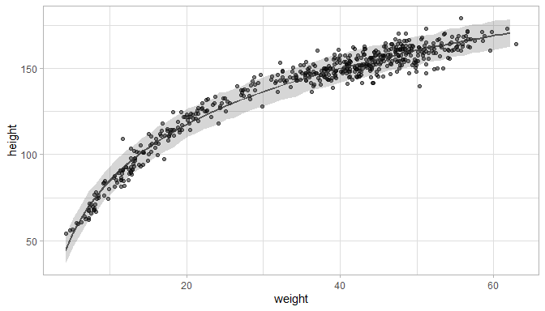
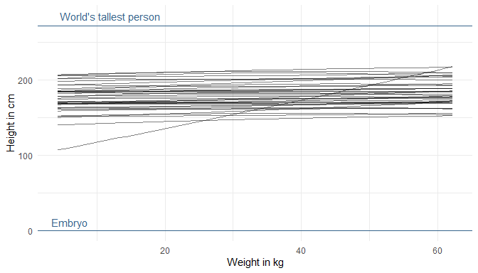
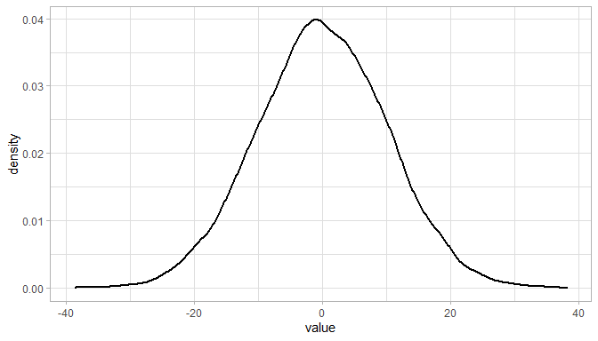
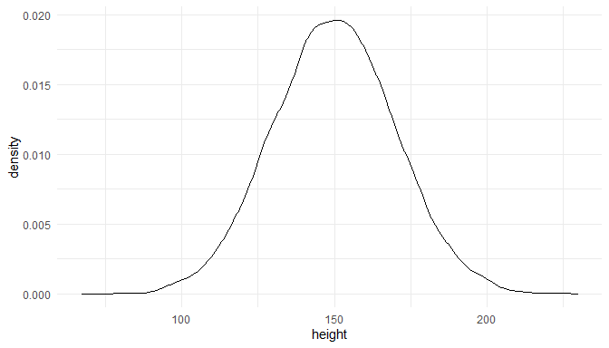
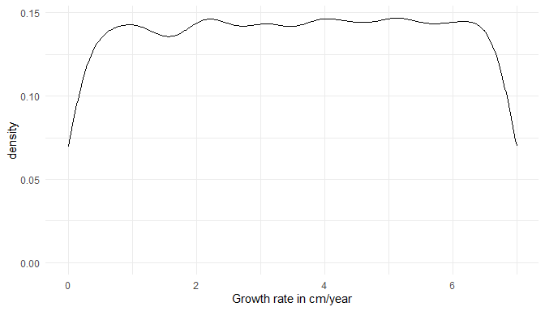

# Introduction 

This is the third part of a series where I work through the practice questions of the second edition of Richard McElreaths [Statistical Rethinking](https://xcelab.net/rm/statistical-rethinking/). Each post covers a new chapter. There are already some awesome sources for this book online like [Jeffrey Girard](https://jmgirard.com/statistical-rethinking-ch2/) working through the exercises of the first edition, or [Solomon Kurz](https://bookdown.org/ajkurz/Statistical_Rethinking_recoded/) leading through each example of the book with the *brms* and the *tidyverse* packages. You can even watch the [lectures of McElreath](https://www.youtube.com/playlist?list=PLDcUM9US4XdNM4Edgs7weiyIguLSToZRI) on Youtube and work through the [homework and solutions](https://github.com/rmcelreath/statrethinking_winter2019/tree/master/homework).
However, so far I couldn't find a source providing solutions for the practice questions of the second edition, or the homework practices, in a tidy(-verse) way. My aim here is therefore to provide solutions for each homework and practice question of the second edition, using the *tidyverse* and the *rethinking* packages. The third part of the series will cover chapter 4, which corresponds to week 2 of the lectures and homework. 

# Homework

## Question 1

**The weights listed below were recorded in the !Kung census, but heights were not recorded for these individuals. Provide predicted heights and 89% intervals for each of these individuals. That is, fill in the table below, using model-based predictions.**


| Individual | weight | expected height| 89% Interval|
|:----------:|:------:|---------------:|------------:|
|     1      | 46.95  |                |             |
|     2      | 43.72  |                |             |
|     3      | 64.78  |                |             |
|     4      | 32.59  |                |             |
|     5      | 54.63  |                |             |

We can use a linear regression model to predict height from weight. First, let's load the census data and the new weights:


```r
# data
data("Howell1")
d <- Howell1

# new data to predict from 
new_weight <- c(46.95, 43.72, 64.78, 32.59, 54.63)
```

For the model, we use the same structur and priors as given on page 102. Further, we use all data (both juveniles and adults) and use quadratic approximation for the posterior. 


```r
# model formula
m <- alist(
  height ~ dnorm(mu, sigma),
  mu <- a + b * (weight - mean(weight)),
  a ~ dnorm(178, 20),
  b ~ dlnorm(0, 1),
  sigma ~ dunif(0, 50)) %>% 
  # model fit using quadratic approximation
  quap(data = d)
```

Now we can calculate the posterior distribution of heights for each individual weight value in the table using the `link()` function, as explained on page 105. From these posterior distributions, we can calculate the mean and the 89% percentile interval using `summarise_all()`. 


```r
# predict height 
pred_height <- link(m, data = data.frame(weight = new_weight))

# calculate means
expected <- pred_height %>% 
  as_tibble() %>% 
  summarise_all(mean) %>% 
  as_vector()

# calculate percentile interval
interval <- pred_height %>% 
  as_tibble() %>% 
  summarise_all(HPDI, prob = 0.89) %>% 
  as_vector()
```

Now we just have to add the predicted values to the table:


```r
tibble(individual = 1:5, weight = new_weight, expected = expected, 
       lower = interval[c(TRUE, FALSE)], upper = interval[c(FALSE, TRUE)]) %>% 
  knitr::kable(align = "cccrr")
```


| individual | weight | expected |    lower|    upper|
|:----------:|:------:|:--------:|--------:|--------:|
|     1      | 46.95  | 135.5123 | 134.8773| 136.2137|
|     2      | 43.72  | 129.8192 | 129.0650| 130.4878|
|     3      | 64.78  | 166.9389 | 166.0810| 167.9576|
|     4      | 32.59  | 110.2018 | 109.1985| 111.1761|
|     5      | 54.63  | 149.0488 | 148.3791| 149.7403|

## Question 2

**Model the relationship between height (cm) and the natural logarithm of weight (log-kg). Use the entire `Howell1` data frame, all 544 rows, adults and non-adults. Fit this model, using quadratic approximation. Use any model type from chapter 4 that you think useful: an ordinary linear regression, a polynomial or a spline. Plot the posterior predictions against the raw data.**

First, let's take a look at the data:


```r
d %>% 
  mutate(log.weight = log(weight)) %>% 
  ggplot() +
  geom_point(aes(log.weight, height), alpha = 0.5) +
  theme_minimal()
```

<!-- -->

It actually looks like a decent linear relationship, so a simple linear regression should be sufficient. All we need to change from the previous model is to log-transform the weight.


```r
m_log <- alist(
  height ~ dnorm(mu, sigma),
  mu <- a + b * log(weight),
  a ~ dnorm(178, 20),
  b ~ dlnorm(0, 1),
  sigma ~ dunif(0, 50)) %>% 
  quap(data = d)
```

Let's glimpse at the results:

```r
precis(m_log) %>% as_tibble() %>% 
  add_column(parameter = rownames(precis(m_log))) %>% 
  rename("lower" = '5.5%', "upper" = '94.5%') %>% 
  select(parameter, everything()) %>% 
  knitr::kable(align = "lcrrr")
```


|parameter |    mean    |        sd|      lower|      upper|
|:---------|:----------:|---------:|----------:|----------:|
|a         | -22.883056 | 1.3343385| -25.015587| -20.750526|
|b         | 46.819974  | 0.3823385|  46.208923|  47.431025|
|sigma     |  5.137358  | 0.1559046|   4.888192|   5.386524|

Instead of trying to read these estimates, we can just visualise our model. Let's calculate the predicted mean height as a function of weight, the 97% PI for the mean, and the 97% PI for predicted heights as explained on page 108.  
  
As we will repeat these steps throughout the exercises, we can set up a function for the interval calculation:


```r
# we better make a function out of it since we use it more often
tidy_intervals <- function(my_function, my_model, interval_type, 
                           x_var, x_seq){
  # preprocess dataframe
  df <- data.frame(col1 = x_seq)
  colnames(df) <- x_var
  
  # calculate 89% intervals for each weight
  # either link or sim
  my_function(my_model, data = df) %>% 
  as_tibble() %>% 
  #  either PI or HPDI
  summarise_all(interval_type, prob = 0.89) %>% 
  add_column(type = c("lower", "upper")) %>% 
  pivot_longer(cols = -type, names_to = "cols", values_to = "intervals") %>% 
  add_column(x_var = rep(x_seq, 2)) %>% 
  pivot_wider(names_from = type, values_from = intervals)
}
```

Now let's use this function to calculate the intervals:


```r
# define weight range
weight_seq <- seq(from = min(d$weight), to = max(d$weight), by = 1)

# calculate 89% intervals for each weight
intervals <- tidy_intervals(link, m_log, HPDI, 
                            x_var = "weight", x_seq = weight_seq)

# calculate means
reg_line <- link(m_log, data = data.frame(weight = weight_seq)) %>%
  as_tibble() %>%
  summarise_all(mean) %>%
  pivot_longer(cols = everything()) %>% 
  add_column(weight = weight_seq)
    

# calculate prediction intervals
pred_intervals <- tidy_intervals(sim, m_log, PI, 
                                 x_var = "weight", x_seq = weight_seq)
```

Now we can plot the raw data, the posterior mean from, the distribution of mu (which corresponds to the 89% HPDI of the mean), and the region within which the model expects to find 89% of actual heights in the population.


```r
ggplot(d) +
    geom_point(aes(weight, height), alpha = 0.5) +
    geom_ribbon(aes(x = x_var, ymin = lower, ymax = upper),
                alpha=0.8, data = intervals) +
    geom_ribbon(aes(x = x_var, ymin = lower, ymax = upper),
                alpha=0.2, data = pred_intervals) +
    theme_light()
```

<!-- -->
  
This looks like a decent fit. Let's make a function of the ggplot, so we can call it later on:


```r
plot_regression <- function(df, x, y, # results, 
                            interv = intervals, pred_interv = pred_intervals){
  ggplot(df) +
    geom_point(aes({{x}}, {{y}}), alpha = 0.5) +
    geom_ribbon(aes(x = x_var, ymin = lower, ymax = upper),
                alpha=0.8, data = interv) +
    geom_ribbon(aes(x = x_var, ymin = lower, ymax = upper),
                alpha=0.2, data = pred_interv) +
    theme_light()
}
```

## Question 3  
  
**Plot the prior predictive distribution for the polynomial regression model in Chapter 4. You can modify the prior predictive distribution. 20 or 30 parabolas from the prior should suffice to show where the prior probability resides. Can you modify the prior distributions of a, b1, and b2 so that the prior predictions stay within the biologically reasonable outcome space? That is to say: Do not try to fit the data by hand. But do try to keep the curves consistent with what you know about height and weight, before seeing these exact data.**  
  
Let us first recap how the polynomial regression model in Chapter 4 was built: The first thing was to standardise the predictor variables, in our case the `weight` variable. Additionally, we calculate the square of the standardised weight. 


```r
# standardise weight
d_stand <- d %>% mutate(weight_s = (weight - mean(weight)) / sd(weight), 
              weight_s2 = weight_s^2) %>% 
  as_tibble()
```

And here's the notation of the model with the priors used in the chapter:


```r
# fit model
m_poly <- alist(height ~ dnorm(mu, sigma), 
               mu <- a + b1 * weight_s + b2 * weight_s2,
               a ~ dnorm(178, 20), 
               b1 ~ dlnorm(0, 1), 
               b2 ~ dnorm(0, 1), 
               sigma ~ dunif(0, 50)) %>% 
  quap(data = d_stand)
```

For this quap, we can sample from the prior distribution using the `extract.prior()` function. We then pass these samples from the prior to the link function for the weight space we are interested in. After transforming the weight back to natural scale, we can take a look at the prior probabilities. 


```r
# set seed
set.seed(123)

# get 30 samples for each parameter (a, b1, b2, sigma) 
m_poly_prior <- extract.prior(m_poly, n = 30)

# now pass the samples from the prior distribution to the link function 
m_poly_mu <- link(m_poly, post = m_poly_prior, 
     data = list(weight_s = seq(from = min(d_stand$weight_s),
                                to = max(d_stand$weight_s), 
                                length.out = 50), 
                 weight_s2 = seq(from = min(d_stand$weight_s2),
                                 to = max(d_stand$weight_s2), 
                                 length.out = 50))) %>% 
  as_tibble() %>% 
  pivot_longer(cols = everything(), names_to = "name", values_to = "height") %>% 
  add_column(weight_s = rep(seq(from = min(d_stand$weight_s),
                              to = max(d_stand$weight_s), 
                              length.out = 50), 30)) %>% 
  mutate(weight = weight_s * sd(d_stand$weight) + mean(d_stand$weight), 
         name = rep(1:30, each = 50), 
         name = as.factor(name))
```


```r
# plot it
ggplot(m_poly_mu, aes(x = weight_s, y = height)) +
  geom_hline(yintercept = c(0, 272), colour = "coral") +
  geom_line(aes(group = name)) +
  theme_light()
```

<!-- -->

Unfortunately, I get straight lines and no parabolas. I couldn't figure out why this is. To compare my results with those from McElreath himself, follow [this link](https://github.com/rmcelreath/statrethinking_winter2019/blob/master/homework/week02_solutions.pdf).  
  
  
# Easy practices  
  
All the easy questions don't require new R code and are already covered by [Jeffrey Girard](https://jmgirard.com/statistical-rethinking-ch4/). 

# Medium practices 
  
## Question 4M1
  
**For the model definition below, simulate observed y values from the prior (not the posterior).**  
  
$y_{i} ∼ Normal(μ,σ)$  
$μ ∼ Normal(0,10)$  
$σ ∼ Exponential(1)$  
  
We can simply sample from each prior distribution:  


```r
# sample mu
sample_mu <- rnorm(1e4, 0, 10)

# sample sigma
sample_sigma <- rexp(1e4, 1)

# sample y
prior_y <- rnorm(1e4, sample_mu, sample_sigma) %>% 
  enframe()

# plot
ggplot(prior_y) +
  geom_density(aes(value), size = 1) + 
  theme_light()
```

<!-- -->


## Question 4M2  
  
**Translate the model just above into a `map()` formula**
  

```r
map_frm <- alist(y ~ dnorm(mu, sigma), 
                 mu ~ dnorm(0, 10), 
                 sigma ~ dexp(1)) 
```

## Question 4M3  

**Translate the `map()` model formula below into a mathematical model definition.**  
  

```r
flist <- alist(
  y ~ dnorm(mu, sigma),
  mu <- a + b*x,
  a ~ dnorm(0, 50),
  b ~ dunif(0, 10),
  sigma ~ dunif(0, 50))
```
  
$y_{1} ∼ Normal(μ,σ)$  
$μ_{1} ∼ α + βx_{1}$  
$α ∼ Normal(0, 50)$   
$β = Uniform(0, 10)$  
$σ ∼ Uniform(0, 50)$
  
  
## Question 4M4  
  
**A sample of students is measured for height each year for 3 years. After the third year, you want to fit a linear regression predicting height using year as a predictor. Write down the mathematical model definition for this regression, using any variable names and priors you choose. Be prepared to defend you choice of priors.**  
  
We can use a simple linear regression approach for this.  
First the likelihood, assuming that height is normally distributed:  
$h_{1} ∼ Normal(μ,σ)$  
  
The linear model:  
$μ_{1} ∼ α + βx_{1}$  
  
The prior for the intercept. It says nothing about the age of the students, so I use a weak prior for the intercept, covering elementary school to adults as shown in the plot below:  
$α ∼ Normal(150, 20)$  
  
  

```r
tibble(height = rnorm(10000, 150, 20)) %>% 
  ggplot() +
  geom_density(aes(height)) +
  theme_minimal()
```

<!-- -->
  
Likewise, the prior for the growth rate needs to adjust for fast growing juveniles and for smaller growing older students. We can't use a normal distribution because students don't shrink (to my knowledge). A uniform distribution forces only positive growth rates.  
$β = Uniform(0, 7)$  


```r
tibble(growth = runif(10000, 0, 7)) %>% 
  ggplot() +
  geom_density(aes(growth)) +
  labs(x = "Growth rate in cm/year") +
  theme_minimal()
```

<!-- -->
  
Now we just need to add a prior for sigma, the standard deviation of the height. I chosse a weak prior, which is within the reasonable height space (the first plot). A sigma above 40 would lead to height values outside of this range (second plot):  
$σ ∼ Uniform(0, 30)$
  

```r
tibble(height = rnorm(10000, 150, 30)) %>% 
  ggplot() +
  geom_density(aes(height)) +
  labs(x = "Height in cm", title = "sigma = 30") +
  theme_minimal()

tibble(height = rnorm(10000, 150, 40)) %>% 
  ggplot() +
  geom_density(aes(height)) +
  labs(x = "Height in cm", title = "sigma = 40") +
  theme_minimal()
```


  
## Question 4M5  
  
**Now suppose I tell you that the average height in the first year was 120 cm and that every student got taller each year. Does this information lead you to change your choice of priors? How?**

An average height of 120cm tells us that the students are children. We can keep our likelihood and linear model, but need to adjust the prior for alpha, beta, and sigma slightly. For alpha, we can use the new mean of 120. For beta (the growth rate), we can use a log normal distribution to force positive values and make them slightly bigger as before, as children tend to grow faster. For sigma, we can reduce it slightly as the spread is probably reduced with children. 
  
$h_{1} ∼ Normal(μ,σ)$  
  
$μ_{1} ∼ α + βx_{1}$  
  
$α ∼ Normal(150, 20)$  

$β = LogNormal(2, 0.5)$  
  
$σ ∼ Uniform(0, 20)$
